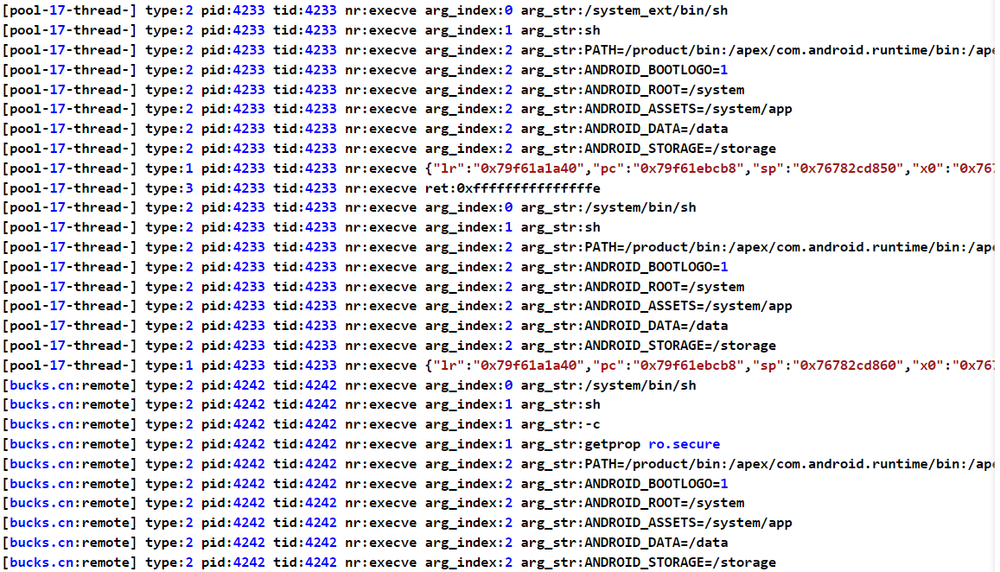

# estrace

estrace是一款基于eBPF的syscall追踪工具，适用于安卓平台

特性：

- 对字符串参数进行读取输出
- 支持计算syscall调用时的lr

部分命令说明：

- `--syscall` 支持同时追踪多个syscall，请使用`,`分隔
- `--no-syscall` 即syscall黑名单，在不指定`--syscall`时可以使用
- `--no-tid` 即线程id黑名单，在部分线程疯狂输出时建议使用，也支持多个，请使用`,`分隔
- `--no-uid-filter` 使用该选项后不对uid进行过滤，用于某些APP使用`isolatedProcess`的情况

# 要求

- 手机有root权限
- 手机内核版本大于等于5.10（目前仅在5.10测试过）

**真机推荐：Redmi Note 11T Pro**

# 使用

首先将estrace推送到手机，并添加可执行权限

```bash
adb push estrace /data/local/tmp
adb shell chmod +x /data/local/tmp/estrace
```

进入`adb shell`，`在root用户下`执行命令，示例如下：

```bash
/data/local/tmp/estrace --name com.starbucks.cn --syscall execve --getlr -o trace.log
```



项目提供了一个`--bypass`选项，你可以使用该选项测试过掉root检查，当然这里只是进行简单演示

对应eBPF程序的关键代码请查看[raw_syscalls.c](src/raw_syscalls.c)的`send_data`函数

原理是比较可读字符串参数，命中预设的字符串时，将其内容改写，参考命令如下：

```bash
./estrace --name io.github.vvb2060.mahoshojo -o tmp.log --quiet --bypass
```

可以实现过momo的root检测，演示效果如下：

[momo root bypass](./images/oCam_2022_12_04_23_03_56_661.mp4)

我这里magisk被安装到了`/dev/.magisk`，所以可能并不适用于其他情况，仅供参考，有兴趣请自行修改源码测试

更多命令，请执行`./estrace --help`查看

# 编译

本项目在linux x86_64下使用Go + NDK交叉编译

1. 首先请下载解压好`NDK r25`，并安装`Go 1.18`

2. 然后同步好必要的源代码

```bash
git clone https://github.com/SeeFlowerX/ebpf
git clone https://github.com/SeeFlowerX/ebpfmanager
git clone https://github.com/SeeFlowerX/estrace
```

3. 进入代码目录，同步外部库

```bash
cd estrace
```

```bash
mkdir -p external && cd external

git clone https://android.googlesource.com/platform/bionic --depth=1
mkdir system && cd system

git clone https://android.googlesource.com/platform/system/core --depth=1
cd ..

git clone https://android.googlesource.com/platform/external/libbpf --depth=1
cd ..
```

4. 设置Go环境变量

```bash
go env -w GO111MODULE=on
go env -w GOPROXY=https://goproxy.cn,direct
```

5. 设置NDK环境变量，**请修改NDK_ROOT为自己的NDK解压路径**

```bash
export NDK_ROOT=/home/kali/Desktop/android-ndk-r25b
export PATH=$NDK_ROOT/toolchains/llvm/prebuilt/linux-x86_64/bin:$PATH
```

6. 编译，产物在`bin/estrace`

```bash
make clean && make
```

也可以直接把编译涉及的命令整合到脚本中，编译后立刻推送到手机，示例：

```bash
export NDK_ROOT=/home/kali/Desktop/android-ndk-r25b
export PATH=$NDK_ROOT/toolchains/llvm/prebuilt/linux-x86_64/bin:$PATH

make clean && make

adb push bin/estrace /data/local/tmp
adb shell chmod +x /data/local/tmp/estrace
```

# TODO

- 更详细的信息输出

# Thanks

- [ehids/ebpfmanager](https://github.com/ehids/ebpfmanager)
- [cilium/ebpf](https://github.com/cilium/ebpf)
- [maiyao1988/ebpf-plugin](https://github.com/maiyao1988/ebpf-plugin)