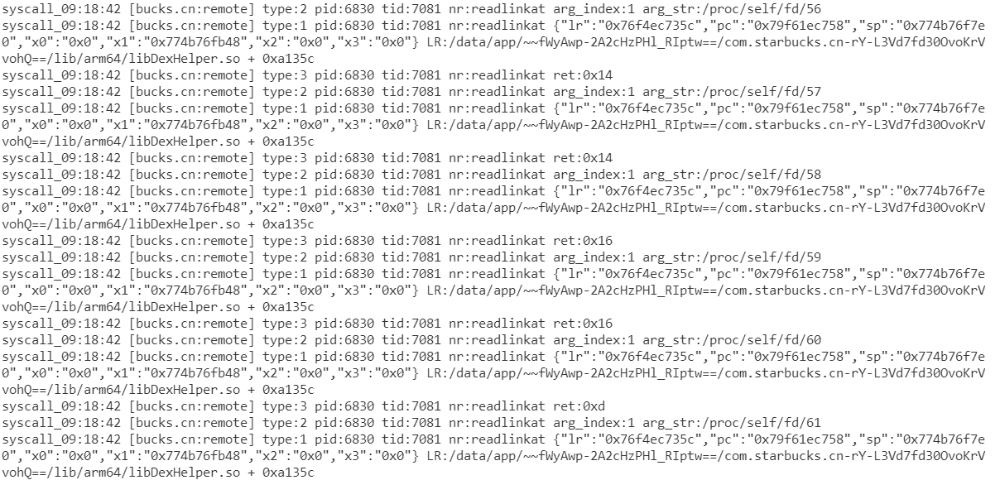

# estrace

estrace是一款基于eBPF的syscall追踪工具，适用于安卓平台

特性：

- 对字符串参数进行读取输出
- 支持计算syscall调用时的lr

# 要求

- 手机有root权限
- 手机内核版本大于5.4（目前仅在5.10测试过）

~~真机推荐：Redmi Note 11T Pro/Pixel 6~~

# 使用

首先将estrace推送到手机，并添加可执行权限

```bash
adb push estrace /data/local/tmp
adb shell chmod +x /data/local/tmp/estrace
```

进入`adb shell`，`在root用户下`执行命令，示例如下

```bash
/data/local/tmp/estrace --name com.starbucks.cn --syscall execve --getlr -o trace.log
```


```bash
/data/local/tmp/estrace --name com.starbucks.cn --nr 78 --getlr -o readlinkat.log
```



# 编译

本项目在linux x86_64下使用Go + NDK交叉编译

1. 首先请下载解压好`NDK r25`，并安装`Go 1.18`

2. 然后同步好必要的源代码

```bash
git clone https://github.com/SeeFlowerX/ebpf
git clone https://github.com/SeeFlowerX/ebpfmanager
git clone https://github.com/SeeFlowerX/estrace
```

3. 进入代码目录，同步外部库

```bash
cd estrace
```

```bash
mkdir -p external && cd external

git clone https://android.googlesource.com/platform/bionic --depth=1
mkdir system && cd system

git clone https://android.googlesource.com/platform/system/core --depth=1
cd ..

git clone https://android.googlesource.com/platform/external/libbpf --depth=1
cd ..
```

4. 设置Go环境变量

```bash
go env -w GO111MODULE=on
go env -w GOPROXY=https://goproxy.cn,direct
```

5. 设置NDK环境变量，**请修改NDK_ROOT为自己的NDK解压路径**

```bash
export NDK_ROOT=/home/kali/Desktop/android-ndk-r25b
export PATH=$NDK_ROOT/toolchains/llvm/prebuilt/linux-x86_64/bin:$PATH
```

6. 编译，产物在`bin/estrace`

```bash
make clean && make
```

也可以直接把编译涉及的命令整合到脚本中，编译后立刻推送到手机，示例：

```bash
export NDK_ROOT=/home/kali/Desktop/android-ndk-r25b
export PATH=$NDK_ROOT/toolchains/llvm/prebuilt/linux-x86_64/bin:$PATH

make clean && make

adb push bin/estrace /data/local/tmp
```

# TODO

- 更详细的信息输出
- 对于启动的shell进程似乎追踪不到返回结果，待优化逻辑

# Thanks

- [ehids/ebpfmanager](https://github.com/ehids/ebpfmanager)
- [cilium/ebpf](https://github.com/cilium/ebpf)
- [maiyao1988/ebpf-plugin](https://github.com/maiyao1988/ebpf-plugin)